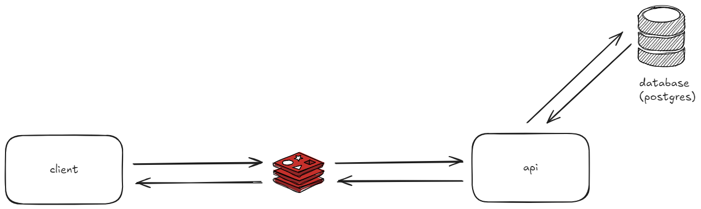

# TaskFlow - Sistema de Gerenciamento de Tarefas

## 🎯 **Descrição do projeto:**

TaskFlow é um sistema intuitivo de gerenciamento de tarefas que permite aos usuários realizar operações de CRUD (Criar, Ler, Atualizar e Excluir) de maneira simples.O projeto é construído utilizando NestJS para fornecer uma API RESTful robusta, com validações de permissões e proteção contra a criação de tarefas duplicadas.



## 🐛 **Como executar a aplicação:**

O projeto segue uma arquitetura monorepo, utilizando o Turborepo como auxiliar. Para rodar o sistema localmente, siga os passos abaixo:

1. Clone o repositório e acesse a pasta backend:

```bash
$ git clone https://github.com/jhonyrdesouza/taskflow
```

2. Faça uma cópia do arquivo `.env.template` para `.env` em cada app (client e API) e configure as variáveis de ambiente necessárias.

3. Gerando Chaves JWT RSA 256 (Pública e Privada): O TaskFlow utiliza autenticação baseada em tokens JWT (JSON Web Tokens), assinados com o algoritmo RSA 256, garantindo maior segurança nas operações. Para que a aplicação possa assinar e verificar esses tokens, é necessário gerar um par de chaves: uma chave privada para assinar os tokens e uma chave pública para verificar as assinaturas.

Gerar a chave privada: A chave privada será usada para assinar os JWTs emitidos pela API do TaskFlow, Execute o comando abaixo no terminal para gerar a chave privada (private.pem).

```bash
$ openssl genrsa -out private.pem 2048
```

Isso cria uma chave privada RSA de 2048 bits e a salva no arquivo private.pem. Essa chave deve ser mantida em segurança e nunca compartilhada publicamente.

Extrair a chave pública: A chave pública será usada para verificar a assinatura dos JWTs nos sistemas que consumirem a API. Ela pode ser compartilhada com outros serviços que precisem validar os tokens.

Execute o seguinte comando para extrair a chave pública (public.pem) a partir da chave privada:

```bash
$ openssl rsa -in private.pem -pubout -out public.pem
```

> Referência: https://gist.github.com/Holger-Will/3edeea6855f1d69a5368871bce5ea926.

4. Instale as dependências do projeto, para esse projeto estamos utilizando o gerenciador de pacotes `pnpm`.

5. Certifique-se de ter um banco de dados PostgreSQL disponível. Você pode instalá-lo localmente ou rodá-lo via Docker (recomendado). Para configurar o Docker, consulte a seção abaixo. Uma vez que o PostgreSQL estiver rodando, prossiga para o próximo passo:

6. Para **executar as migrações** no banco de dados com a definições contidas em `schema.prisma`,
   execute na raiz do projeto `pnpm migrations` em seu terminal:

```bash
$  pnpm migrations
```

7. Gere a instância do **client do prisma** (código Typescript) (juntamente com as entidades definidas no `schema.prisma`), executando `pnpm generate` em seu terminal e escolhendo:

```bash
$  pnpm generate
```

8. Execute a aplicação em modo dev:

```bash
$  pnpm dev
```

**Nota:** As aplicações estarão disponíveis nas portas _3000_ e _3001_ (localhost:3000 e localhost:3001). Ambas serão iniciadas automaticamente pelo Turborepo.

## 🐳 **Docker:**

Para desenvolvimento local, com reload na aplicação, você pode usar o arquivo `docker-compose.yaml` para criar um container com o banco de dados Postgres. Execute o seguinte comando:

## 🚀 **Roadmap de desenvolvimento e publicação:**

### Desenvolvimento de uma nova feature:

1. Crie uma branch para a nova feature com o seguinte padrão: `feat/<feature-name>`

```bash
$ git checkout -b feat/<feature-name>
```

2. Durante o desenvolvimento, faça commits nesta branch. Quando a feature estiver concluída, faça o merge na branch `develop`.

```bash
$ git checkout develop
```

```bash
$ git merge feat/<feature-name> --no-ff
```

## 🔗 **Link da documentação da api no Swagger:**

A aplicação possui uma documentação detalhada da API no Swagger para obter informações abrangentes sobre os endpoints, parâmetros, autenticação e exemplos de solicitações e respostas:

**Nota:** O acesso é em: `localhost:3000/api/docs`.
